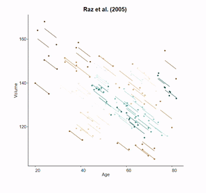

<!-- README.md is generated from README.Rmd. Please edit that file -->

# rmcorrShiny

<!-- badges: start -->
<!-- badges: end -->

The goal of rmcorrShiny is to compute and visualize repeated measures
correlation (rmcorr). Rmcorr is the common within-individual linear
association for paired, repeated measures data. Rmcorr is conceptually
similar to a null multilevel model: a fixed slope and varying intercept
by participant.

## Getting Started

### 1. Web application

You can access and use rmcorrShiny at
<https://lmarusich.shinyapps.io/shiny_rmcorr/>

### 2. R package

You can also install and run rmcorrShiny locally using the following
code:

``` r
# install.packages("devtools")
devtools::install_github("lmarusich/rmcorrShiny")
library(rmcorrShiny)
rmcorrShiny::rmcorrShiny()
```

## Interface

### Screenshot


### Demo of Interactive Plot



## More information and Credits

See “About this app”
